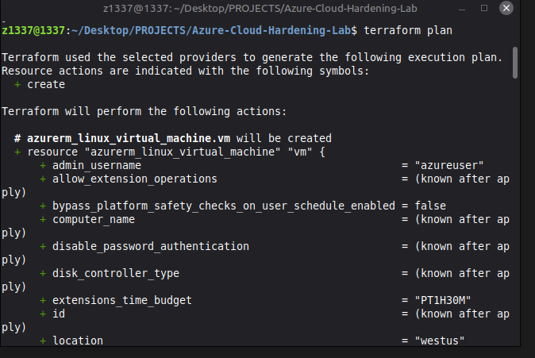
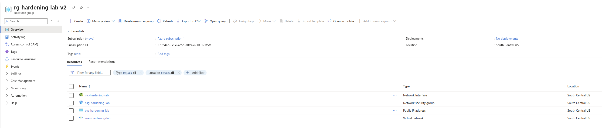
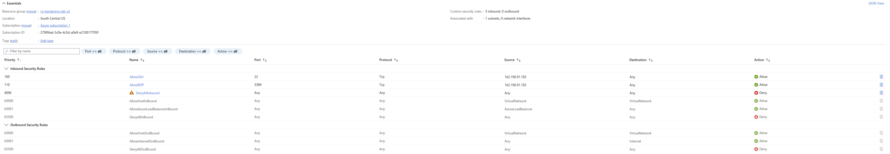
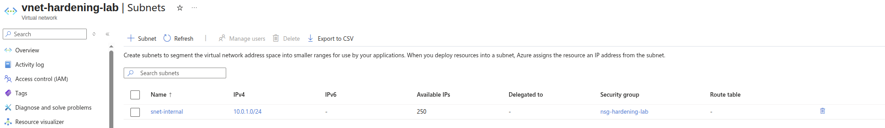

# Azure Cloud Hardening Lab (IaC)

This project demonstrates **Infrastructure as Code (IaC)** best practices for deploying secure cloud environments. I used **Terraform** to provision a "Hardened" Azure infrastructure that follows the Principle of Least Privilege.

## 🔒 Security Focus

- **Network Security Groups (NSG):** Only allows SSH/RDP traffic from a single authorized IP address.
- **Data Encryption:** All storage accounts and managed disks are configured with AES-256 encryption at rest.
- **Identity Management:** Managed Identities used for resource access (no hardcoded credentials).
- **Public IP Management:** Minimized public exposure by only assigning IPs where absolutely necessary.

## 🛠️ Technologies
- **Azure** (Cloud Provider)
- **Terraform** (Infrastructure as Code)
- **HCL** (HashiCorp Configuration Language)

## Infrastructure Overview
1. **Virtual Network (VNet):** Isolated network segment.
2. **Subnet:** Secured with a strict Network Security Group.
3. **Virtual Machine:** Hardened Ubuntu instance.
4. **Encryption:** Managed Disk encryption enabled by default.

## How to Deploy
1. Install Terraform.
2. Authenticate with Azure CLI (`az login`).
3. Update `authorized_ip` in `variables.tf`.
4. Run `terraform init` and `terraform apply`.

## Evidence (Screenshots)
All screenshots are stored in the `screenshots/` folder.

**1) Terraform plan (proposed resources)**

**2) Hardened infrastructure overview (resource group)**

**3) NSG inbound rules (restricted to authorized IP)**

**4) Subnet association with NSG**

---
*This lab is part of my "Big Three" portfolio projects focused on Cloud Security and Automation.*
